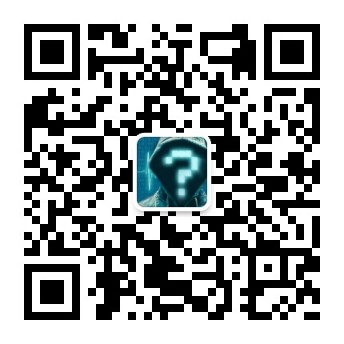

# 说明
- 来自网友基于 [wxappUnpacker](https://github.com/qwerty472123/wxappUnpacker "wxappUnpacker") 改进的开源项目。

# 安装
```
npm install
```

# 安装依赖
```
npm install esprima
    
npm install css-tree
    
npm install cssbeautify
    
npm install vm2
    
npm install uglify-es
    
npm install js-beautify
```

# 分包功能

当检测到 wxapkg 为子包时, 添加-s 参数指定主包源码路径即可自动将子包的 wxss,wxml,js 解析到主包的对应位置下. 完整流程大致如下: 
1. 获取主包和若干子包
2. 解包主包  
    - windows系统使用: `./bingo.bat testpkg/master-xxx.wxapkg`
    - Linux系统使用: `./bingo.sh testpkg/master-xxx.wxapkg`
3. 解包子包  
    - windows系统使用: `./bingo.bat testpkg/sub-1-xxx.wxapkg -s=../master-xxx`
    - Linux系统使用:  `./bingo.sh testpkg/sub-1-xxx.wxapkg -s=../master-xxx`

觉得麻烦?可以使用[自助解包客户端](#自助解包客户端)

TIP
> -s 参数可为相对路径或绝对路径, 推荐使用绝对路径, 因为相对路径的起点不是当前目录 而是子包解包后的目录

```
├── testpkg
│   ├── sub-1-xxx.wxapkg #被解析子包
│   └── sub-1-xxx               #相对路径的起点
│       ├── app-service.js
│   ├── master-xxx.wxapkg
│   └── master-xxx             # ../master-xxx 就是这个目录
│       ├── app.json
```

# 公众号
  

# 逆向教程小程序
  

# 自助解包客户端
[基于electron-vue开发的微信小程序自助解包(反编译)客户端](https://github.com/xuedingmiaojun/mp-unpack)

# [小程序逆向视频专栏](https://m.lizhiweike.com/channel2/1037814)
- 还是不知道怎么逆向？
- 遇到问题不会处理？  

快来看看视频系列课程吧~    
[人人都能学会的微信小程序逆向技能](https://m.lizhiweike.com/channel2/1037814)

